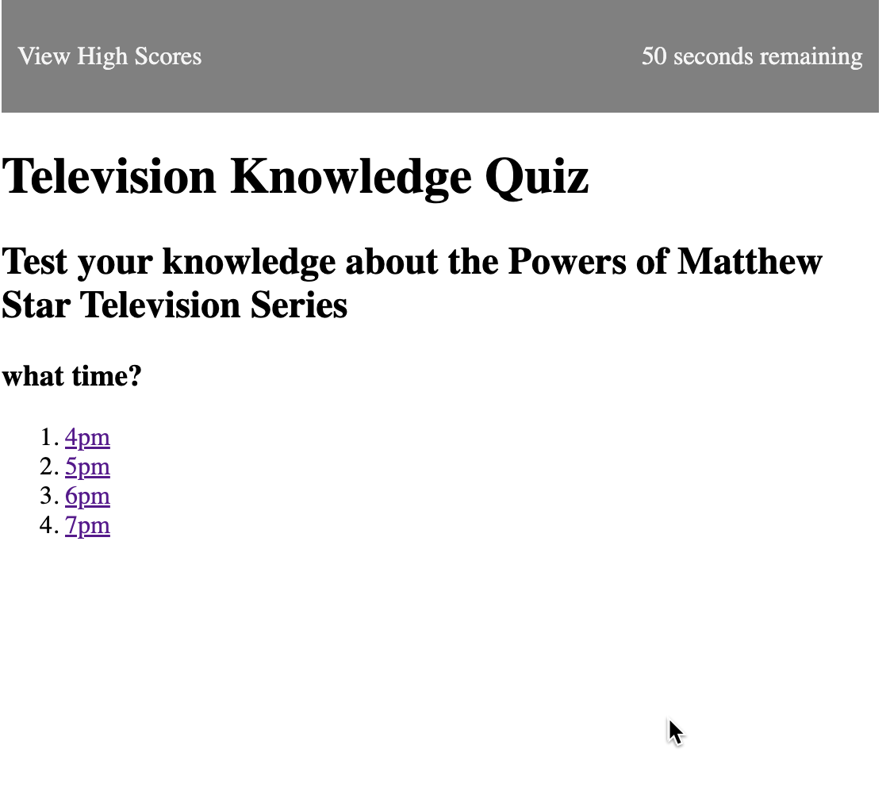

# The Powers of Matthew Star Trivia

## Description
A simple quiz to test your knowledge about the television series known as ***The Powers of Matthew Star***. The code highlights basic usage of the:
- Code to dynamically build HTML
- Use of JavaScript timer and event functions
- Passing objects between functions
- Writing and reading from local browser storage
- Creating and reading JSON structures and arrays

## Installation

There are no installation requirements except to open the single `index.html` page or visit the page: https://qkeddy.github.io/powers-of-matthew-star-code-quiz/.

## Sample Usage

The following GIF showcases a question being asked and selection of multiple choice answers. 

## Credits

Leveraged [this](https://medium.com/@asadise/sorting-a-json-array-according-one-property-in-javascript-18b1d22cd9e9) sorting algorithm to sort the player scores.

## License

N/A

---

